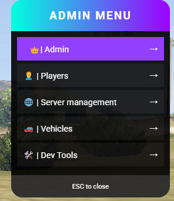

# 🛡️ Painel Admin ESX (Estilo QB)

Este é um script de administração completo e moderno para servidores FiveM baseados em ESX Legacy. Ele possui uma interface NUI limpa e intuitiva, inspirada no estilo QB-Core, oferecendo diversas ferramentas para gerenciamento de jogadores, veículos e servidor.

    <h1>🛡️Admin Panel</h1>

   

[ <a  href="prints/">Prints</a>]

## ✨ Funcionalidades

### 👑 Admin Geral
*   **Godmode:** Torna o administrador invencível.
*   **Noclip:** Permite voar e atravessar paredes (invisível).
*   **Revive:** Revive o próprio administrador e restaura a saúde.
*   **TP Waypoint:** Teleporta instantaneamente para o local marcado no mapa.
*   **Nomes / IDs (Head):** Mostra o nome e ID dos jogadores acima de suas cabeças (otimizado por distância).
*   **Blips Jogadores (Map):** Mostra a localização de todos os jogadores no mapa.
*   **Anúncio:** Envia uma mensagem de destaque para todos os jogadores no chat.

### 👥 Gerenciamento de Jogadores
Ao selecionar um jogador da lista, você pode:
*   **Goto:** Teleportar-se até o jogador.
*   **Bring:** Trazer o jogador até você.
*   **Revive:** Reviver o jogador.
*   **Slay:** Matar o jogador.
*   **Kick:** Expulsar o jogador do servidor (com motivo).
*   **Freeze:** Congelar/Descongelar o jogador.
*   **Spectate:** Assistir a tela do jogador.
*   **Sit Vehicle:** Entrar no veículo do passageiro.
*   **Give Skin:** Dar menu de skin para o jogador.

### 🚘 Veículos
*   **Spawn Vehicle:** Menu categorizado com centenas de veículos (Compacts, Sedans, SUVs, Sports, Super, etc.).
*   **Full Tunning:** Aplica tunagem máxima no veículo atual.
*   **Save Garage:** Salva o veículo atual na garagem do administrador (banco de dados).
*   **Fix:** Repara e limpa o veículo instantaneamente.
*   **Colors:** Altera a cor primária e secundária do veículo (menu visual).
*   **Vehicle Dev Mode:** Exibe informações técnicas do veículo na tela (ID, Placa, Motor, Lataria, Gasolina, RPM, Velocidade, Heading, Coordenadas).

### 🔫 Armas
*   **Dar Armas:** Pistola, Combat Pistol, AK-47, M4, Shotgun, Sniper.
*   **Armas Brancas:** Faca, Taco, Canivete, Machete, Lanterna.
*   **Remover Todas:** Remove todas as armas do inventário.

### 🛠️ Ferramentas de Desenvolvedor (Dev Tools)
*   **Copy Vector3:** Copia as coordenadas atuais (x, y, z) para a área de transferência.
*   **Copy Vector4:** Copia as coordenadas e heading (x, y, z, h).
*   **Copy Heading:** Copia apenas a rotação (heading).
*   **Vehicle Dev:** Ativa/Desativa o modo de debug de veículos.

### 🌍 Gerenciamento do Servidor
*   **Weather Options:** Altera o clima do servidor (Ensolarado, Chuva, Neve, Halloween, etc.).
*   **Server Time:** Define a hora do servidor através de um slider (0-23h).
*   **Kick All:** Expulsa todos os jogadores (apenas Superadmin/God).

## 📦 Instalação

1.  Coloque a pasta `admin` dentro do diretório `resources` do seu servidor.
2.  Adicione `ensure admin` no seu `server.cfg`.
3.  Configure as permissões no banco de dados ou `server.cfg` (o script verifica `xPlayer.getGroup()`).

## 🎮 Uso

*   **Comando:** `/admin`
*   **Tecla de Atalho:** `INSERT` (Padrão)

## ⚙️ Dependências

*   `es_extended` (ESX Legacy)
*   `oxmysql` (Para salvar veículos)
*   `esx_ambulancejob` (Para reviver)

## 📝 Créditos

Desenvolvido com auxílio de IA (Gemini) para a comunidade FiveM.
